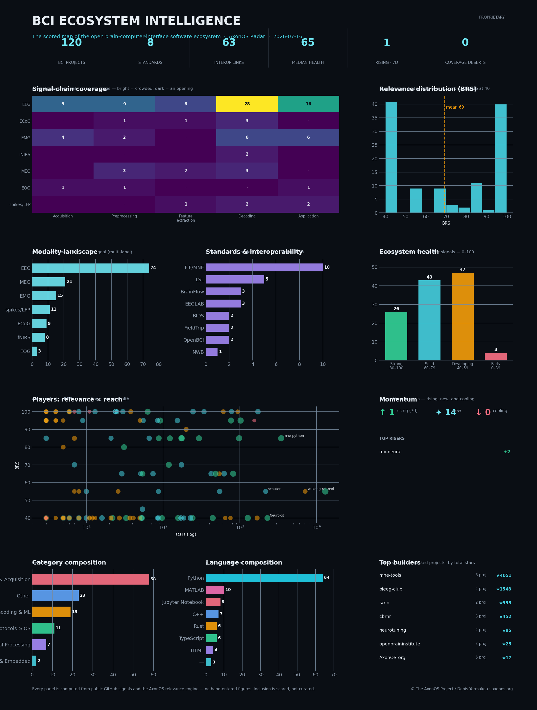

<div align="center">

# AxonOS Radar

### The open brain–computer-interface field — mapped, scored, and explained automatically.

#### A living **intelligence engine** for open neurotech. Every public BCI repository on GitHub, discovered from real signals, scored 0–100 by a purpose-built relevance engine, and explained down to the evidence behind every decision — not a hand-curated list, not hype.

[](https://axonos-bci.github.io/axonos-community-radar/)
[](https://github.com/users/AxonOS-BCI/projects/1)
[](https://github.com/AxonOS-BCI/axonos-community-radar/actions/workflows/ci.yml)
[](https://github.com/AxonOS-BCI/axonos-community-radar/actions/workflows/pages.yml)
[](CHANGELOG.md)
[](CHANGELOG.md)
[](LICENSE)

[](#-the-relevance-engine--scored-inclusion-not-a-curated-list)
[](https://axonos-bci.github.io/axonos-community-radar/)
[](#-how-a-project-gets-on-the-radar)
[](#-the-data--an-open-honest-api)
[](#-architecture--open-core)
[](docs/THREAT_MODEL.md)
[](https://axonos-bci.github.io/axonos-community-radar/)

**[🛰️ Open the live radar →](https://axonos-bci.github.io/axonos-community-radar/)** &nbsp;•&nbsp; **[🗺️ Map](https://axonos-bci.github.io/axonos-community-radar/#map)** &nbsp;•&nbsp; **[📈 Stats](https://axonos-bci.github.io/axonos-community-radar/stats.html)** &nbsp;•&nbsp; **[➕ Add a project](https://github.com/AxonOS-BCI/axonos-community-radar/issues/new/choose)** &nbsp;•&nbsp; **[📰 RSS](https://axonos-bci.github.io/axonos-community-radar/feed.xml)**

</div>

---

**AxonOS Radar** is the continuously-updated, public map of the open brain–computer-interface world — and, since v7, an **intelligence engine** rather than a directory (now on the v8 open-core line). On a schedule it scans **public GitHub metadata**, decides whether each candidate is *genuinely* a BCI/neuro project through a scored relevance engine (not generic ML that merely says "neural"), records the exact evidence for every decision, maps the field's modalities, standards and signal-chain coverage, tracks momentum and health, and renders all of it as an interactive radar, an ecosystem map, a statistics dashboard, a self-updating GitHub issue, and a weekly investor-grade intelligence report.

The BCI field is scattered across hundreds of GitHub repositories with no map. AxonOS
Radar is that map — but it doesn't just *list* projects, it **scores** them. A purpose-built
relevance engine reads every candidate, decides whether it's genuinely a brain–computer
interface project (not generic ML that happens to say "neural"), and shows you **exactly why**.
The result is the first honest, continuously-updated intelligence layer for neurotech software.

> **Discovery, not endorsement.** Inclusion never implies quality, safety, or clinical fitness, and listing transfers no ownership. Scores are discovery signals computed from public evidence. **AxonOS itself is scored by the exact same engine as everyone else** — there is no self-boosting, and no figure on this map is hand-curated to flatter anyone.

---

## 💡 &nbsp;What it is, and why it matters

The BCI field is scattered across hundreds of repositories with no map and no honest scoreboard. The Radar is both — and it serves three audiences from one evidence base:

| For… | What they get |
|:--|:--|
| **Investors & scouts** | An independent, continuously-updated read on *what's real* in open BCI — relevance score, evidence tier, momentum, ecosystem position — that doesn't come from a pitch deck. A due-diligence layer for a field that had none. |
| **Researchers & builders** | Discover the libraries, decoders, hardware and protocols that actually exist, see what's gaining momentum in *your* modality, find the people building multiple projects worth following — and get scored and seen yourself. |
| **The ecosystem** | The first honest census of open BCI software: where the field is dense, where it's thin, which standards win, and where it's heading — computed live from verifiable signals, not opinion. |

> **The anti-hype contract.** Every link is real. Every project is discovered live from public data. Inclusion is **scored, and every score carries its evidence** — the signals that raised it and the signals that lowered it, each with a plain-language reason. *Rising* reflects measured 7-day star velocity, not editorial choice. AxonOS is ranked by the same rules and currently sits mid-field; the engine has no way to flatter anyone.

### The pains this radar closes

Open BCI has real, recurring pains. Each maps to a **mechanism you can verify** — not a promise:

| The field's pain | What the radar does about it |
|:--|:--|
| **Fragmentation.** Hundreds of scattered repos, no map, no scoreboard. | The live radar + card grid + ecosystem map, refreshed on schedule, with a **scored** inclusion rule and an evidence tier on every entry. |
| **The "is this even BCI?" problem.** Generic ML dressed as neuro. | The **Relevance Engine** scores every repo and drops ML clones with a recorded reason — a PyTorch fork never sits next to a neural interface. |
| **Opaque rankings.** Most "top BCI" lists are editorial. | Every inclusion carries a **public, signed evidence ledger** — tap a card, see exactly why it's here and what it scored. No black box. |
| **Abandonment blindness.** Projects die quietly; people build on corpses. | **Health** (recency, 52-week commits, team breadth) + **Rising/Falling** from measured velocity — decay is visible *before* you depend on it. |
| **Blind spots.** Nobody knows where the field is thin. | The **coverage matrix** surfaces deserts (empty modality × stage cells) — the open gaps, made visible. |
| **The trust question: "can I build on this?"** | **Foundation `n/7`** — seven checkable facts per repo (licence, README, CONTRIBUTING, code of conduct, `CITATION.cff`, `SECURITY.md`, CI). Facts, not vibes. |
| **Integration guesswork.** Every stack speaks its own protocol. | **Interop detection** + the **standards graph** — "who speaks LSL / BrainFlow / BIDS / NWB", filterable in one tap. |
| **Reproducibility friction.** Getting field data into a notebook is an afternoon. | Stable JSON endpoints + a CI-validated JSON Schema. `radar.json` and you're done. |

---

## 🖼️ &nbsp;The BCI Ecosystem Intelligence dashboard

One page, the whole field — rendered **entirely from radar data, with no hand-entered figures.** This is the market-intelligence read-out funds, scouts and labs use to see the open BCI landscape at a glance:



## 📛 Badges — get scored, get seen

Every project on the map carries a **live scored badge** — BRS + relevance
tier, straight from the engine's last scan:

[](https://axonos-bci.github.io/axonos-community-radar/)

Open your project's evidence ledger on the map and press **Copy badge**, or take
the Markdown from [`badges/index.json`](https://axonos-bci.github.io/axonos-community-radar/badges/index.json).
Derived, never granted; updates every ~3 hours. [How it works →](docs/BADGES.md)

| Panel | What it answers |
|:--|:--|
| **KPI strip** | Projects tracked · standards in play · interoperability links · median health · rising this week · coverage deserts — the ecosystem in six numbers. |
| **Signal-chain coverage** | A modality × pipeline-stage heatmap: *where the field is crowded, and where the open gaps (deserts) are* — i.e. where the opportunity is. |
| **Relevance distribution (BRS)** | The shape of how BCI-specific the field is, gate at 40, with the mean. |
| **Modality landscape** | Projects per biosignal — EEG dominance, ECoG/fNIRS thinness — the market composition. |
| **Standards & interoperability** | Which standards win (MNE/FIF, LSL, BIDS, NWB…) and the connective tissue between projects. |
| **Ecosystem health** | Maturity bands across the field — strong / solid / developing / early. |
| **Players: relevance × reach** | Every project as BRS vs stars (log), size = health — who the players are and where they sit. |
| **Momentum** | Rising, new, and cooling projects, with the top risers named. |
| **Category & language composition · Top builders** | What the field is built for, built with, and by whom. |

The **generator is proprietary** (the AxonOS engine — how the intelligence is computed and composed); the **rendered report is the deliverable**, refreshed weekly. Licensing for funds and labs: [connect@axonos.org](mailto:connect@axonos.org).

---

## 🧠 &nbsp;The Relevance Engine — scored inclusion, not a curated list

The heart of v7. Older directories used a boolean gate: *has a neuro topic → in.* That let "dynamic **neural** networks" (a PyTorch clone) sit next to a real neural interface. The Relevance Engine replaces the gate with a **BCI Relevance Score (BRS, 0–100)** built from a **signed ledger of evidence** — every signal that raised or lowered the score, each with a reason. A project is kept only when BCI-specific evidence outweighs generic-ML noise (gate at **40**).

| Positive evidence (raises BRS) | Negative evidence (lowers BRS) |
|:--|:--|
| **Explicit BCI** topic (`bci`, `brain-computer-interface`) — the strongest signal | **ML-framework identity** (a PyTorch/TensorFlow/Keras clone) — heavily penalised |
| **Field standard / toolkit** (LSL, BIDS, EDF, NWB, MNE, OpenBCI, BrainFlow) | **"neural" with no neuro-anchor** (deep-learning "neural", not neuro) |
| **Acquisition hardware** (ADCs, headsets, amplifiers) | **Generic ML / AI-agent** framing with no biosignal |
| **Modality** (EEG · ECoG · EMG · fNIRS · MEG · EOG · spikes/LFP) | **Neuromorphic** compute (chips, not brain signals) |
| **Paradigm** (P300 · SSVEP · motor-imagery · neurofeedback) | **Neuroimaging-only** / **cardiac** signals (adjacent, not BCI) |
| **Neuro terms** (electrophysiology, cortical) — anchored | *penalties are cancelled by concrete hard evidence, so a real project with an unlucky keyword still scores correctly* |

**`neural` disambiguation** — the engine anchors: "neural **interface**" is kept; "**neural** network / deep learning" is dropped, unless genuine neuro-evidence is present. **The ledger is public** — on the live radar, tap any card's **BRS badge** and the full "why it's included" panel unfolds: every `+`/`−` signal, its points, its reason. No black box; the score is auditable per project.

---

## 🏅 &nbsp;Evidence tiers

Every kept project lands in a tier that states *why* it qualifies — earned from the ledger, not assigned by hand:

| Tier | Meaning | Typical evidence |
|:--|:--|:--|
|  | Names itself a brain–computer interface | `bci`, `brain-computer-interface`; explicit BCI hardware |
|  | Wired into the field's tooling | LSL · BIDS · OpenBCI · BrainFlow · NWB; acquisition hardware |
|  | Works a real biosignal or paradigm | EEG · ECoG · EMG · fNIRS; P300 · SSVEP · motor-imagery |
|  | Genuine neuro-evidence, weaker signal | electrophysiology, cortical, neural-decoding (anchored) |
|  | Borderline — passes the gate, flagged | low score, may be reviewed |
|  | Generic ML / off-topic | recorded reason; **not shown** |

---

## 🗺️ &nbsp;Domain intelligence — the field as a system

Beyond scoring, the engine reads *what each project is about* and assembles the ecosystem's structure:

| Layer | What it computes |
|:--|:--|
| **Facets** | Per project: **modality**, **paradigm**, **signal-chain stage** (Acquisition → Preprocessing → Feature extraction → Decoding → Application), and **standards** spoken. |
| **Coverage matrix** | The whole field as a modality × stage grid — surfacing **deserts** (e.g. fNIRS is nearly empty; ECoG decoding is thin) that are, for a builder or investor, open opportunities. |
| **Standards interoperability graph** | Which standards dominate and how projects interconnect through shared standards — the connective tissue of the ecosystem. |
| **"Speaks" interop pills** | 20 protocols/formats/toolkits/hardware detected word-boundary-strictly from a reviewable vocabulary ([`data/interop-vocab.json`](data/interop-vocab.json)). One tap filters the field to *everything that speaks LSL*. |

Explore it live in the **Map** view — the coverage heatmap with desert callouts, and the standards graph.

---

## 🩺 &nbsp;Ecosystem Health

Every project carries a 0–100 **Health** read-out plus six sub-scores, computed **only from real public GitHub signals the scan already fetches** — no surveys, no self-assessment. Unmeasurable dimensions are **left out, not guessed**:

| Dimension | Measured from |
|:--|:--|
| **Maintenance** | How recently the repo was pushed to |
| **Momentum** | The real 52-week commit total — is development sustained? |
| **Adoption** | Stars, published releases, real release download counts |
| **Team** | Contributor breadth — more than a bus-factor of one? |
| **Licence** | Whether an OSI-recognised licence grants clear reuse rights |
| **Doc signals** | Presence of a description, homepage, and licence file |

Plus **Foundation `n/7`** — seven checkable repository facts (community profile, `CITATION.cff`, `SECURITY.md`, CI workflows). Facts, not vibes; absence shows as absence, never a fabricated zero.

> **Health is a triage signal, not a verdict.** A high score means a repo looks well-maintained, adopted, and clearly licensed — **never** that it is correct, safe, or clinically fit.

---

## 📈 &nbsp;Momentum

The radar is an instrument, not a snapshot. From a persistent snapshot history it tracks, week over week:

- **↑ Rising** — measured 7-day star velocity, not opinion.
- **✦ New** — genuine first-discovery (durable `first_seen` dates), never a re-count.
- **↓ Cooling** — losing velocity, so decay is visible *before* you build on it.

---

## 🎯 &nbsp;Why it matters — the scoreboard, and the badge flywheel

The radar is becoming the **canonical reference layer** for neurotech. The mechanism that gets it there is a two-sided flywheel:

1. **Projects want in.** Being discovered and scored — with a high BRS and a strong evidence tier — is public credibility. Projects embed their radar badge the way they embed a build-passing badge.
2. **Investors trust it.** For a VC, that badge is a **one-glance due-diligence marker**: independently scored, evidence-backed, momentum-aware — not a self-reported claim.
3. **The pull compounds.** More projects seek the badge → the map gets more complete → investors rely on it more → more projects seek the badge. The scoreboard becomes the standard.

That flywheel — **projects in the queue to be scored, investors reading the badges as diligence** — is how a directory becomes infrastructure.

---

## 🏷️ &nbsp;Badges — get scored, get seen

**Listed projects can display the radar badge today:**

<div align="center">

[](https://axonos-bci.github.io/axonos-community-radar/)

</div>

```md
[](https://axonos-bci.github.io/axonos-community-radar/)
```

**Embed the live ecosystem pulse** (a [shields.io endpoint](https://shields.io/badges/endpoint-badge) fed by the radar):

```md

```

| Badge | Status | What it signals |
|:--|:--|:--|
| **On AxonOS Radar** | ✅ live | The project is tracked on the radar |
| **Live ecosystem pulse** | ✅ live | The ecosystem's current project count, auto-updating |
| **Scored badge** — `BRS 95 · Explicit BCI` | 🛠 v12 | Per-project relevance + tier, embeddable — the due-diligence marker |
| **Verified badge** | 🛠 v12 | A reviewed quality signal projects apply for — *the queue* |

**Want your project scored?** It's automatic — the engine discovers public BCI repos on every scan. To flag one now, [open a Feature request](https://github.com/AxonOS-BCI/axonos-community-radar/issues/new/choose).

---

## 🧭 &nbsp;The four views

| View | What it shows |
|:--|:--|
| **Projects** | The interactive radar (categories as sectors, recency as distance, stars as size) + a searchable, filterable card grid. Each card carries its real GitHub topics, a tappable **BRS badge with the full evidence ledger**, a health meter, and a Rising / New / Falling badge. |
| **Map** | The ecosystem as a connected system — a modality × pipeline-stage **coverage heatmap** (with desert callouts) and a **standards-interoperability** view. The field's shape and its connective tissue, computed from evidence. |
| **Builders** | A leaderboard of *owners with 2+ tracked projects* — total stars, active projects, focus areas. The people, not just the repos. |
| **Methodology** | The inclusion rule, BRS scoring, evidence tiers, Foundation signals, interop detection, and the full data-endpoints contract — in the product, not buried in docs. |

---

## ⚡ &nbsp;Quick start — use it in 30 seconds

| You want to… | Do this |
|:--|:--|
| **See the field** | Open the [live radar](https://axonos-bci.github.io/axonos-community-radar/). Tabs: **Projects · Map · Builders · Methodology**. |
| **Find something specific** | Press <kbd>/</kbd> to search, or filter by category, language, *active 30d*, *new*, or evidence tier. |
| **See why a project is listed** | Tap its **BRS badge** — the signed evidence ledger unfolds on the card. |
| **See momentum & the ecosystem shape** | Open **Map** and the [Statistics](https://axonos-bci.github.io/axonos-community-radar/stats.html) page. |
| **Follow new launches** | Subscribe to the [RSS feed](https://axonos-bci.github.io/axonos-community-radar/feed.xml), or watch the auto-updating **Live Ecosystem Stats** issue. |
| **Add a project** | [Open an issue](https://github.com/AxonOS-BCI/axonos-community-radar/issues/new/choose) — discovered on the next scan. |
| **Build on the data** | Fetch [`data/radar.json`](data/radar.json) (schema: [`data/radar.schema.json`](data/radar.schema.json)) — plain, versioned JSON. |

---

## 📊 &nbsp;The data — an open, honest API

No key, no signup. Everything the UI shows is plain, versioned JSON you can build on:

| File | Contents |
|:--|:--|
| [`data/radar.json`](https://axonos-bci.github.io/axonos-community-radar/data/radar.json) | The full scored payload — projects with **BRS**, **evidence ledger**, **relevance tier**, category, facets, stars, deltas, `rising`, a `signals` health block, plus the **`coverage_matrix`** and **`standards_graph`** and a `builders[]` roll-up. Schema: [`radar.schema.json`](data/radar.schema.json). |
| [`data/history.json`](https://axonos-bci.github.io/axonos-community-radar/data/history.json) | Per-snapshot aggregates (totals, active, new, rising, stars) — the time series behind trends and *Rising*. |
| [`data/first_seen.json`](https://axonos-bci.github.io/axonos-community-radar/data/first_seen.json) | Durable first-seen timestamps — the *new* flag. |
| [`data/interop-vocab.json`](data/interop-vocab.json) | The interop vocabulary: the exact word-boundary patterns behind every "Speaks" tag. Open to review and PRs. |
| [`feed.xml`](https://axonos-bci.github.io/axonos-community-radar/feed.xml) | RSS of newly-discovered projects. |
| [`data/seeds.json`](data/seeds.json) | The topics, keywords, categories and thresholds that seed the scan. |
| [`data/badge-ecosystem.json`](https://axonos-bci.github.io/axonos-community-radar/data/badge-ecosystem.json) | A shields.io endpoint carrying the ecosystem's live pulse (see [Badges](#-badges--get-scored-get-seen)). |
| [`data/api.json`](https://axonos-bci.github.io/axonos-community-radar/data/api.json) | **The front door** — every endpoint with kind, stability, schema pointer; the freshness contract; licensing. Rebuilt each deploy by walking the artifact, so it lists only what the deploy carries. |
| [`data/signals.json`](https://axonos-bci.github.io/axonos-community-radar/data/signals.json) | What changed this week — **new / rising / cooling** with measured evidence. Schema: [`signals.schema.json`](data/signals.schema.json). Feeds: [all](https://axonos-bci.github.io/axonos-community-radar/feeds/signals.xml) · [new](https://axonos-bci.github.io/axonos-community-radar/feeds/new.xml) · [rising](https://axonos-bci.github.io/axonos-community-radar/feeds/rising.xml). |
| [`data/projects.ndjson`](https://axonos-bci.github.io/axonos-community-radar/data/projects.ndjson) · [`data/projects.csv`](https://axonos-bci.github.io/axonos-community-radar/data/projects.csv) | One project per line for pandas/jq/DuckDB, and the core columns flat for spreadsheets and BI. |
| [`badges/index.json`](https://axonos-bci.github.io/axonos-community-radar/badges/index.json) | **A live scored badge for every project** — shields.io endpoints with ready-to-paste Markdown. Derived from the last scan, never hand-granted ([how to embed](docs/BADGES.md)). |

Full reference, freshness contract, and quick starts: **[docs/API.md](docs/API.md)**. Free with attribution — licensed feeds, SLAs, and custom slices for funds and labs: [connect@axonos.org](mailto:connect@axonos.org).

---

## 🔬 &nbsp;How a project gets on the radar

Generated entirely from **public GitHub topic search** — no scraping, no private data. A repository is scored by the **Relevance Engine** and kept only if its BRS clears the gate (**40**). Keyword matching is anchored at word boundaries, so a *MIDI controller* never slips in on the substring `mi`, and a PyTorch clone never slips in on "neural". Every kept project carries its **evidence tier** and its full **ledger** — the signals that got it there.

**Stable & safe.** Recency is measured from a fixed snapshot, so unchanged projects keep their place. If more than a quarter of topic queries fail, the run aborts *without writing* — the last good map is preserved. Data is committed through the GitHub API, which signs the commit, so the history stays **Verified**.

---

## 🏗️ &nbsp;Architecture — open-core

The radar runs on an **open-core** split: an open showcase, powered by a private engine.

```
   ┌──────────────────────────────┐    generated data only     ┌───────────────────────────────┐
   │  axonos-radar-core (private)  │  ── radar.json, feed, ──▶  │  axonos-community-radar (public)│
   │  the Relevance Engine · IP    │     badges, history        │  UI · map · data · Pages · docs │
   └──────────────────────────────┘   (Verified commits)       └───────────────────────────────┘
```

- **Public (this repo)** — the showcase: the interactive radar, the ecosystem map, the statistics dashboard, and the **published dataset**. Vanilla JavaScript, **zero runtime dependencies**, served by GitHub Pages under a strict Content-Security-Policy.
- **Private engine** — the scoring/discovery IP. It scans, scores, and publishes only the *output* (the live map) into this repo via the GitHub Contents API. **How it scores is private; what it decides, and why, is fully public** in the evidence ledger. Transparency is the moat — not obscurity.

```
axonos-community-radar/            # this repo — the open showcase
├── index.html · stats.html        # radar UI (Projects · Map · Builders · Methodology) + stats
├── assets/  app.js · app.css      # all UI logic & styles (externalised → script-src 'self')
├── data/    radar.json · history.json · first_seen.json · radar.schema.json · interop-vocab.json
├── feed.xml                       # generated RSS
├── docs/    METHODOLOGY.md · THREAT_MODEL.md · assets/  (incl. the dashboard)
└── .github/workflows/  ci.yml · pages.yml · stats-issue.yml · release.yml
```

> **Zero runtime dependencies.** The page is vanilla JavaScript; only CI-time packages (`pytest`, `jsonschema`) are version-pinned in [`requirements-ci.txt`](requirements-ci.txt). Every action is SHA-pinned; **bandit is blocking**; the JSON Schema is a full typed contract.

**Deployment:** the site ships as a single Pages artifact via `pages.yml` (no Jekyll). One-time setting: **Settings → Pages → Source = GitHub Actions**.

---

## 🗺️ &nbsp;Roadmap — to v17

The radar is early. Here's the arc from today to the canonical neurotech intelligence platform. Live board: **[Roadmap →](https://github.com/users/AxonOS-BCI/projects/1)**.

| Version | Theme | What ships |
|:--:|:--|:--|
| **7.0** | The Relevance Engine | ✅ Scored inclusion (BRS) · signed evidence ledger · domain intelligence · ecosystem map |
| **7.1** | Legible | ✅ Per-card BRS badge · inline "why included" ledger · Relevance sort |
| **7.2** | Dashboards | ✅ Generated **BCI Ecosystem Intelligence** dashboard (embedded above) |
| **8.0** | Open-core | ✅ Scoring engine moved fully private; showcase is UI + open data |
| **8.1** | Dashboards, live | ✅ The Stats page is now a live dashboard — coverage matrix, BRS distribution, standards, health |
| **9.0** | Signals | ✅ `signals.json` + RSS feeds per slice · watchlist on Stats · token-free data path |
| **10.0** | Feed | ✅ Data API — `api.json` front door · signals feeds & schema · CSV export · [docs/API.md](docs/API.md) |
| **11.0** | Trajectory | BRS-over-time & star arcs — per-project history accruing since 2026-07-16 |
| **12.0** | **Badges** | ✅ Live scored badge per project — [docs/BADGES.md](docs/BADGES.md) · `badges/index.json` |
| **13.0** | Talent | Contributor & builder graph — the neurotech talent map |
| **14.0** | Capital | Funding & domicile signals — who raised, where, and when |
| **15.0** | Standards | Compliance tracking — LSL/BIDS/NWB conformance, clinical readiness |
| **16.0** | Frontier | Adjacent domains — neuromodulation, neuroprosthetics, spatial compute |
| **17.0** | **The Atlas** | The canonical, real-time intelligence platform for neurotech |

---

## 🧬 &nbsp;Within AxonOS

The Radar is the community-facing edge of a larger open project — an open, real-time neural operating system for BCIs. The engineering it points back to:

| Repository | Role |
|:--|:--|
| [`axonos-kernel`](https://github.com/AxonOS-org/axonos-kernel) | The real-time `no_std` neural kernel — scheduler, time, capability. |
| [`axonos-protocol`](https://github.com/AxonOS-org/axonos-protocol) | The AxonOS Consent Protocol on the wire — `no_std`, zero-alloc. |
| [`axonos-consent`](https://github.com/AxonOS-org/axonos-consent) | Kernel-level consent FSM with formally-bounded withdrawal latency. |
| [`axonos-signal-pipeline`](https://github.com/AxonOS-org/axonos-signal-pipeline) | Fixed-point DSP chain: raw frame → epoch → features → decision. |
| [`axonos-standard`](https://github.com/AxonOS-org/axonos-standard) | The normative AxonOS Standard and claims catalogue. |
| [`axonos-e2e-demo`](https://github.com/AxonOS-org/axonos-e2e-demo) | Synthetic signal → typed intent, bit-for-bit reproducible. |

---

## 💛 &nbsp;Support the organism

Everything public in the AxonOS ecosystem — this radar, the open neural OS — is **free and open: no paywalls, no ads, no tracking, no tokens.** (Premium market-intelligence for funds and labs is a separate channel — it never gates the free map.) If the radar is useful to you, a voluntary Dogecoin tip fuels the work:

<div align="center">

© The AxonOS Project / Denis Yermakou

**axonos.org · [medium.com/@AxonOS](https://medium.com/@AxonOS) · axonosorg@gmail.com**

</div>

Contributions are voluntary — not purchases, not investments, no product entitlement. Commercial licensing (the intelligence feed / reports): [connect@axonos.org](mailto:connect@axonos.org).

---

## 📑 &nbsp;Citation

If you reference AxonOS Radar in academic or technical work, please cite it:

```bibtex
@software{yermakou_axonos_radar_2026,
  author  = {Yermakou, Denis},
  title   = {{AxonOS Radar: a scored, evidence-backed map of the open brain--computer-interface field}},
  year    = {2026},
  url     = {https://github.com/AxonOS-BCI/axonos-community-radar},
  version = {12.0.1}
}
```

GitHub's **"Cite this repository"** button (from [`CITATION.cff`](CITATION.cff)) generates APA and BibTeX automatically.

---

## 🔐 &nbsp;Data & privacy

The radar shows only **public** repository metadata GitHub already exposes (name, description, topics, stars, language, last-push date). It stores no personal data and sets no cookies. The UI is self-contained — vanilla JS under a Content-Security-Policy with externalised scripts (no inline execution, no external requests, no trackers). To request removal, add a repo to the exclude list in [`data/seeds.json`](data/seeds.json) or [open an issue](https://github.com/AxonOS-BCI/axonos-community-radar/issues/new/choose) — see [`SECURITY.md`](SECURITY.md).

## 🤝 &nbsp;Contributing

The map is only as alive as its community, and the bar to help is deliberately low — [open an issue](https://github.com/AxonOS-BCI/axonos-community-radar/issues/new/choose) to add a project or flag a mis-score (the engine's reasoning is recorded, so corrections are fast), talk neurotech in [Discussions](https://github.com/AxonOS-BCI/axonos-community-radar/discussions), or send a PR ([`CONTRIBUTING.md`](CONTRIBUTING.md)).

> **Engagement policy.** We model the community we want: **star** only genuinely relevant repos, **react** only to genuinely relevant releases, **open PRs** only when they add real value. No mass-follows, no auto-comments, no low-signal noise.

## 📄 &nbsp;License

The showcase and the **published data** are released under the [MIT License](LICENSE) — free to use, fork and build on. The **relevance/scoring engine is proprietary** to The AxonOS Project. Inclusion in the data implies no endorsement.

<div align="center">
<br>
<sub>© The AxonOS Project / Denis Yermakou &nbsp;·&nbsp; <a href="https://axonos.org">axonos.org</a> &nbsp;·&nbsp; <a href="https://medium.com/@AxonOS">medium.com/@AxonOS</a> &nbsp;·&nbsp; connect@axonos.org &nbsp;·&nbsp; security@axonos.org</sub>
</div>
